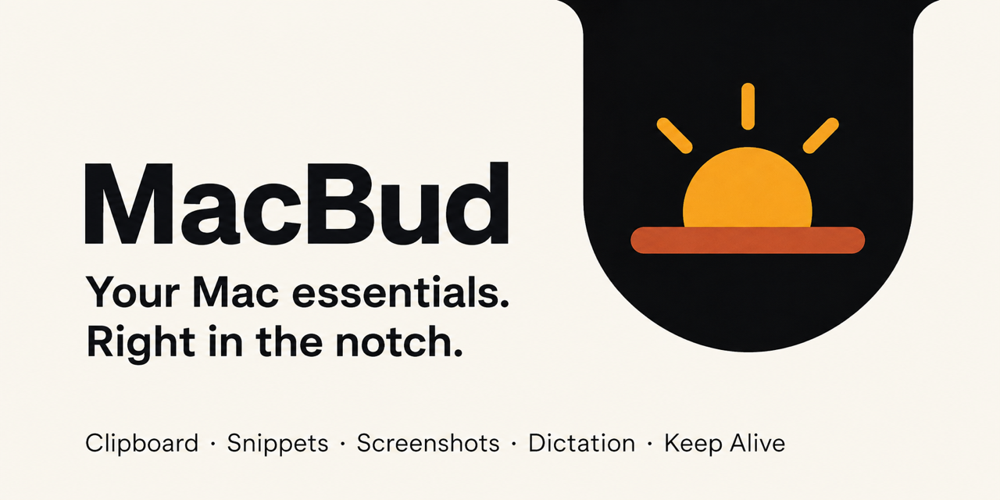

# MacBud



A keyboard-first macOS utility in the MacBook notch: clipboard history, text snippets, screenshots, on-device dictation, and a Keep Alive switch.

- macOS 26 (Tahoe), Apple Silicon. Swift 6, SwiftUI + AppKit.
- [Handoff notes](docs/HANDOFF.md)
- [Design spec](docs/superpowers/specs/2026-09-05-macbud-notch-utility-design.md)

## Controls

- **Features and tab order:** Settings → Features has checkboxes for Clipboard, Snippets, Screenshots, History, Dictation, and Keep Alive. Use the arrows to reorder section tabs; **⌘1–⌘4** inside the island follow that order, so ⌘1 is always the first tab and a hidden tab closes the gap. Disabled features hide their controls and stop their shortcuts/background work; saved data and shortcut preferences are retained. History and Dictation can be enabled independently.
- **Keep Alive:** turn on the switch after the label at the right of the notch to keep the Mac and display awake until you turn it off. Closing the notch leaves it on; quitting MacBud releases it. macOS still controls explicit Sleep and lid closure.
- **Dictation:** press your configured dictation shortcut (default **⌥⇧D**) to start; press it again to stop and insert. The transcript follows its newest words automatically. **Escape** cancels. Return and Command-Return remain with the active app. You can also click **Insert**, **Copy**, or **Cancel** in the bottom action strip.
- **Hold to talk:** hold **⌃⌥D**, speak, and release to stop and insert. Both dictation shortcuts are editable in Settings → Shortcuts. If no editable input is focused, the transcript is copied. Dictation never sends Return.
- **Dictation history:** open the **History** tab (purple dictation icon) to search, copy, insert, delete, or **Save as snippet**. Completed transcripts are stored locally, including older MacBud dictations still in clipboard history. Cancelled recordings are not added.
- **Retry:** transcribes the saved recording without recording again. Temporary audio stays on this Mac and is removed when delivered or discarded.
- Insertion requires macOS Accessibility access; otherwise the transcript is copied. Microphone access is requested when starting a live recording. Speech models download once per language.

## Build

```bash
brew install xcodegen   # once
make run               # generate, build, launch Debug with test automation
make test              # Swift Testing suite
make install           # build Release, update /Applications/MacBud.app, launch normally
make package           # build Release, create a versioned ZIP and SHA-256 in dist/
```

## Releases

Download the ZIP from [GitHub Releases](https://github.com/rangrik/macbud/releases), extract it, and move MacBud.app into Applications. Releases require macOS 26 or later. Release builds contain both Apple Silicon and Intel executables; on-device dictation depends on the speech capabilities available on your Mac.

The current release uses the available Apple Development signing certificate and is **not notarized**. macOS may block a downloaded copy. Developer ID signing and Apple notarization are needed for a release that passes Gatekeeper on other Macs without an override. Local installation uses the same app identity and retains settings and saved data.

`make install` stages and verifies the Release app before replacing the installed copy. It launches without test automation and removes its temporary backup after a successful launch. `make clean` removes local Debug and Release build products; it does not touch the installed app, release ZIPs, or saved data.

The app, notch, welcome screen, and About screen use the supplied sunrise logo with a transparent background in [Resources/Brand](Resources/Brand). Its gold and terracotta colors remain visible on the black notch; the menu bar uses a separate adaptive monochrome template. Regenerate the asset catalog sizes with `swift scripts/make_icon.swift`. Section badges are vector SwiftUI views; the dictation badge opens History.

With Microphone access and a speech model installed, `python3 scripts/check-dictation-startup.py` checks the real microphone callback and dictation window. It restarts `/Applications/MacBud.app`, records briefly, then cancels without delivering text. Run `make install` first when checking a new build.
